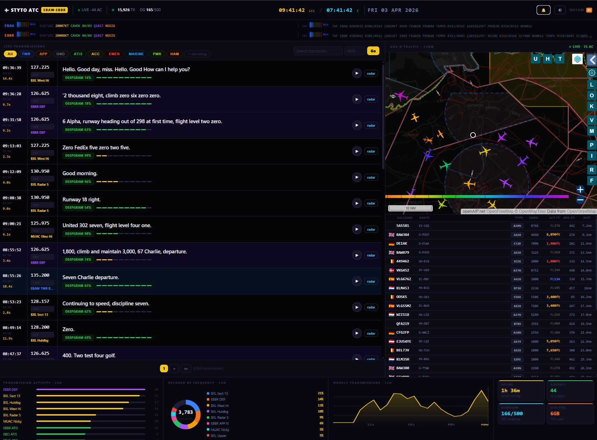

# Airband Scanner Dashboard

Real-time ATC transcript viewer for **EBAW (Antwerp)** and **EBBR (Brussels)**.
An RTL-SDR dongle on a Raspberry Pi captures airband audio, transcribes it via Deepgram, and streams it live to a self-hosted web dashboard.



---

## Features

### Live Transcript Feed
- Transmissions appear in real-time via **Server-Sent Events (SSE)** — no polling, no page refreshes
- Each card shows timestamp, frequency (MHz), role label, duration bar, transcription text, and confidence score
- Colour-coded left stripe per frequency role (TWR blue, APP orange, GND grey, ATIS green, EMER red, ACC yellow, etc.)
- Circular SVG **audio progress ring** around a play/pause button — click to stream the raw recording
- **Radar map modal** per transmission — shows aircraft positions at the exact moment of the transmission

### Frequency Intelligence
- 100+ known frequencies across EBAW, EBBR, EBOS, EBLG, EBCI, Brussels ACC, Maastricht MUAC, Amsterdam, military, marine, PMR446, and amateur radio
- Frequency type auto-detection: TWR / APP / ARR / DEP / DEL / GND / ATIS / ACC / EMER / MARINE / HAM / PMR / DATA
- **Pill filter bar** — filter live feed by type (TWR, APP, GND, ATIS, EMER, ACC, …) with client-side instant filtering
- ATIS frequencies excluded from the live feed to reduce noise

### Emergency Alerting
- **Full-screen red overlay** with pulsing animation fires when:
  - A transmission is received on **121.500 MHz** or **243.000 MHz** (Guard / Emergency)
  - An aircraft in the ADS-B feed squawks **7700** (emergency), **7600** (radio failure), or **7500** (hijack)
- Emergency squawk cells highlighted red in the aircraft table
- **Browser push notification** support — click the bell icon in the topbar to grant permission
- Alert auto-dismisses after 90 seconds or on ACKNOWLEDGE

### ADS-B Panel
- Live **tar1090 radar iframe** — aircraft blips, trails, and click-to-inspect
- Aircraft table (up to 30 within 150 km): flag, callsign, route, type, squawk, altitude, speed, distance
- Altitude colour coding: red < 3,000 ft, amber < 10,000 ft, blue < FL280, grey above
- Country flags from ICAO hex range lookup
- Refreshes every 30 seconds

### Analytics Strip
- **Frequency activity bars** — top 10 most active frequencies in the current session
- **Decoder type donut** — Deepgram nova vs Whisper vs other, with percentage legend
- **24-hour transmission sparkline** — rolling window of completed hours with UTC labels
- **KPI cards**: uptime, live aircraft count, Deepgram requests today (/ 500 daily limit), total transmissions, free disk

### Weather Bar
- Live **METAR** for EBAW and EBBR (auto-refresh every 10 min)
- **TAF** alongside each METAR
- QNH millibar bar visualiser

### Other
- **NOTAM badge** in topbar with total count, links to NOTAM search
- **Dual clock** — local (CET/CEST) and Zulu (UTC)
- **Dark / light theme** toggle (persisted in localStorage)
- Responsive layout — collapses to single column on mobile

---

## Stack

| Component | Detail |
|---|---|
| **Hardware** | Raspberry Pi + RTL-SDR SDRJUB dongle (Realtek RTL2838) |
| **SDR** | `shajen/sdr-hub` Docker container with `auto_sdr` scanner via SoapySDR |
| **Transcription** | Deepgram Nova-2 (via `deepgram-worker`) |
| **ADS-B** | RTLSDRBlog V4 dongle → `readsb` → `tar1090` |
| **Database** | SQLite (`/opt/sdr-hub/data/db.sqlite3`) |
| **Dashboard** | Pure Python HTTP server — no framework, no JS build step |
| **Realtime** | Server-Sent Events (SSE) |
| **Audio** | Raw `.cu8` files decoded on-the-fly to WAV and streamed |

---

## Architecture

```
RTL-SDR dongle
    └── auto_sdr (SoapySDR)
            └── sdr-hub Docker → DB (SQLite)
                    └── deepgram-worker → transcript_viewer.py (port 8002)
                                                └── SSE → browser

RTLSDRBlog V4 dongle
    └── readsb → tar1090 (port 8080)
                    └── /data/aircraft.json → transcript_viewer.py → ADS-B panel
```

---

## Deployment

**Pi:** `pi-adsb` (Tailscale), user `pi`

```bash
scp transcript_viewer_new.py pi-adsb:/tmp/transcript_viewer.py && \
ssh pi-adsb "sudo cp /tmp/transcript_viewer.py /opt/deepgram-worker/transcript_viewer.py && \
             sudo systemctl restart transcript-viewer"
```

Service: `transcript-viewer.service` on port `8002`

---

## Pi Infrastructure

| Cron | Schedule | Purpose |
|---|---|---|
| `disk_rotation.py` | 03:00 daily | Delete oldest audio files when disk > threshold |
| Pi reboot | 04:00 daily | Clean USB state, flush memory |
| `sdr_watchdog.sh` | Every 15 min | Reboot if crash loop (>5 exits/5 min) or 3h daytime silence |

**Known failure mode:** The SDRJUB dongle (RTL2838) can enter a bad USB state after an unclean crash. `SoapySDR` reports `TIMEOUT`. Only fix: physical USB power-cycle or Pi reboot.

---

## Live URLs

| Service | URL |
|---|---|
| Dashboard | `sdr.tangosierra.one` |
| tar1090 ADS-B | `1090.tangosierra.one` |
